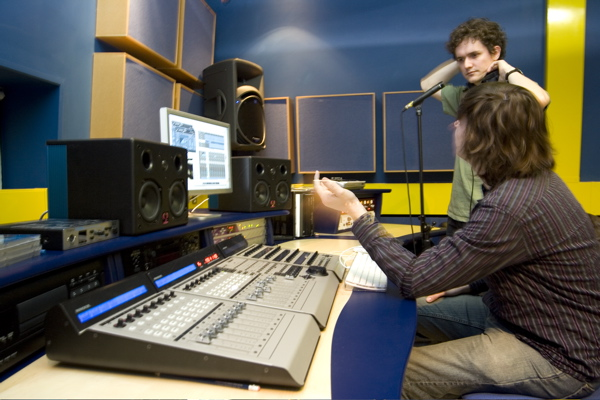
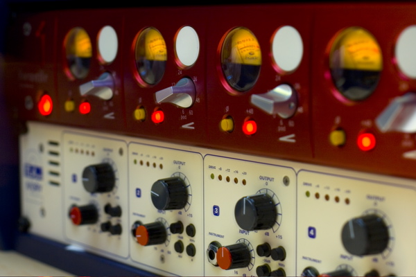

title: home
menu-position: 0
---

<h1></h1>

The Centre for Digital Music is a world-leading multidisciplinary research group in the field of Music & Audio Technology. Since its founding members joined Queen Mary in 2001, the Centre has grown to become arguably the UK’s leading Digital Music research group.

<a class="twitter-timeline" href="https://twitter.com/c4dm" data-widget-id="561187870955040769" data-chrome="nofooter" width="300" height="900">Tweets by @c4dm</a>

Research themes:

* [Audio Engineering](#)
* [Augmented Instruments](#)
* [Interactional Sound & Music](#)
* [Machine Listening](#)
* [Music Informatics](#)
* [Music Cognition](#)
* [Music Performance & Expression](#)

The C4DM is a research group of the QMUL [School of Electronic Engineering and Computer Science](http://www.eecs.qmul.ac.uk/).

Keywords: Music Information Retreival, Music Informatics, Semantic Audio, Semantic Web for Music, Digital Signal Processing for Music and Audio, Transient Analysis and Onsets,Independent Component Analysis, Blind Source Separation, Sparse Representations, Knowledge Discovery, Knowledge Processing.

