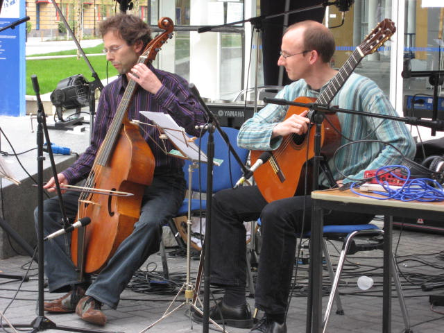
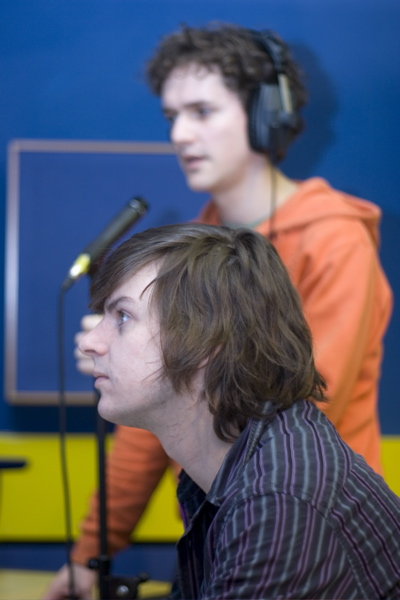

title: Study Opportunities in the C4DM
---------

PhD Study
=========

**UKRI Centre for Doctoral Training in Artificial Intelligence and Music (AIM): 12 fully-funded PhD studentships to start September 2019** 
**Visit the AIM website for more details: [https://www.aim.qmul.ac.uk/](https://www.aim.qmul.ac.uk/)**

The Centre for Digital Music at Queen Mary University of London is a world-leading research group in the field of Music & Audio Technology. Our research covers everything in digital music and audio: from analysis, understanding and retrieval to delivery, synthesis and sound rendering. We seek not only to investigate new applications of digital signal processing (DSP), but also to push forward the frontiers of DSP itself.

Please see our list of [completed PhD theses in C4DM](phds.html) and our list of [current members of C4DM](people.html) for the wide range of topics we study.

PhD researchers are currently sought in a range of topics under any of our [research themes](index.html). Possible topic areas might include: automatic music transcription; harmony analysis; auditory scene analysis; beat tracking & rhythm analysis; blind source separation & independent component analysis (ICA); joint audio/video tracking and transcription; A/D & D/A conversion; sigma delta modulation; scalable audio codecs; object based coding; sparse representations & sparse coding; music information retrieval; semantic markup, musical metadata & MPEG7 applications; audio effects; 3D sound & multi-loudspeaker rendering systems; intelligent microphone arrays; automatic accompaniment; interactive performance/internet jamming; interactive compositional tools; biologically inspired audio processing; and pervasive audio ("my music wherever I am"). We have recently invested £300k in a new state-of-the-art audio listening facility, and we are keen to encourage at least one project in the area of 3D sound which would be allied to this new facility.

For more information about the Centre for Digital Music and our research, see [http://c4dm.eecs.qmul.ac.uk/](http://c4dm.eecs.qmul.ac.uk/)

Funding
-------

The Centre for Digital Music is part of the School of Electronic Engineering and Computer Science, which has a number of EPSRC-funded Research Studentships that cover fees and maintenance for UK students, or fees-only for EU students. Additional studentships are often available There is always strong competition for Research Studentships, so early application is recommended. Applications are also welcomed from self-funded students.
Application

Applicants should follow the guidelines that can be found at [http://www.eecs.qmul.ac.uk/phd/how-to-apply](http://www.eecs.qmul.ac.uk/phd/how-to-apply)

Informal enquiries
------------------

Please contact: Prof Mark Sandler, email: mark.sandler@qmul.ac.uk

